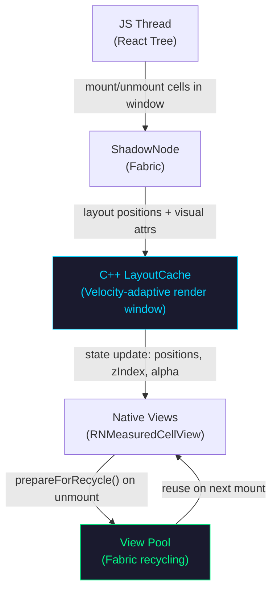
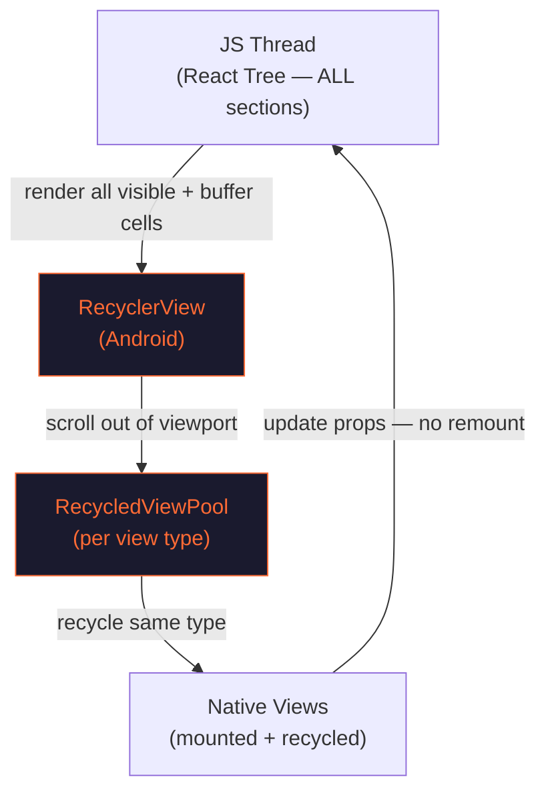
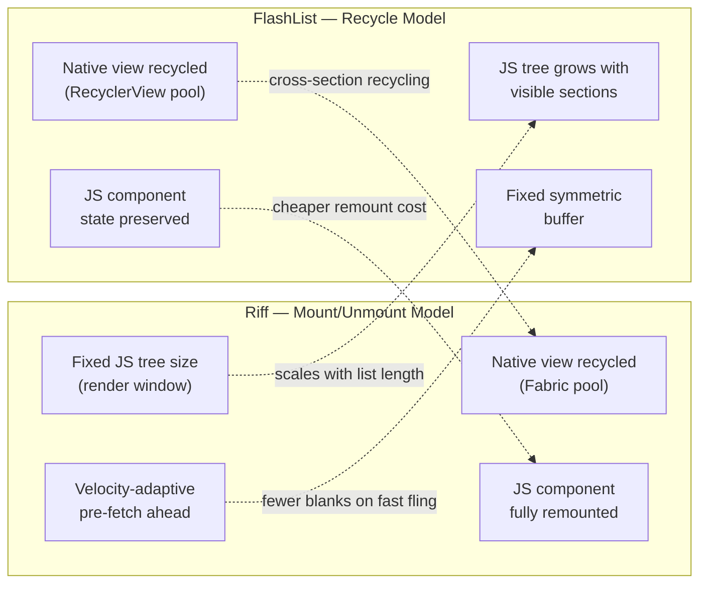

# Riff vs FlashList — Android Performance Analysis

> Benchmarked on production page types: Search Results, Homepage, Storefront.
> All numbers from instrumented scroll sessions on the same device under identical conditions.

---

## Table of Contents

1. [Architecture Overview](#architecture-overview)
2. [Key Differences](#key-differences)
3. [Benchmark Results](#benchmark-results)
   - [Search Results](#search-results)
   - [Homepage](#homepage)
   - [Storefront](#storefront)
4. [Cross-Page Summary](#cross-page-summary)
5. [Reasoning & Grilling Guide](#reasoning--grilling-guide)
6. [Conclusion](#conclusion)

---

## Architecture Overview

### How Riff Works

**Key properties:**
- JS tree contains **only cells within the render window** — bounded regardless of list length
- Render window expands ahead of scroll direction based on velocity (velocity-adaptive)
- Cells outside the window are **unmounted from the JS tree** — not just hidden
- Native view instances are **recycled** via Fabric's view pool on unmount

---

### How FlashList Works

**Key properties:**
- JS tree contains **all visible + buffered cells** — grows with section count
- Cells are **recycled across sections** when types match (cross-section recycling)
- JS component instance is **reused** — state, refs, hooks survive across data items
- Native view is never destroyed — just updated with new props

---

## Key Differences

| Property | Riff | FlashList |
|---|---|---|
| JS tree size | Fixed (render window) | Grows with visible sections |
| Recycling layer | Native views (Fabric pool) | JS components + Native views |
| Render window | Velocity-adaptive | Fixed symmetric buffer |
| Cross-section recycling | No | Yes |
| Unmounts outside window | Yes | No |
| Scales with list length | Yes | Partial |

---

## Benchmark Results

### Search Results

> Long homogeneous feed. Single dominant cell type. Deep scroll session.

| Metric | Riff | FlashList | Winner |
|---|---|---|---|
| Avg FPS | **44** | 40 | **Riff** |
| Min FPS | **40** | 28 | **Riff** |
| p5 FPS | **40** | 28 | **Riff** |
| JS Idle | **69%** | 57% | **Riff** |
| Avg CPU | **61%** | 77% | **Riff** |
| p75 CPU | **76%** | 98% | **Riff** |
| p90 CPU | **83%** | 99% | **Riff** |
| Avg Mem | -574 MB | **-660 MB** | Flash |
| Peak Mem | 6.7 MB | **-456 MB** | Flash |
| Active Avg | **9** | 63 | **Riff 7.0x** |
| Active p75 | **12** | 86 | **Riff 7.2x** |
| Active Peak | **14** | 86 | **Riff 6.1x** |
| Total Mounts | **614** | 2811 | **Riff 4.6x** |

**Score: Riff 11 — Flash 4 — Tied 0**

---

### Homepage

> Image and video heavy. Mixed section types. Moderate scroll depth.

| Metric | Riff | FlashList | Winner |
|---|---|---|---|
| Avg FPS | 58 | **59** | Tied |
| Min FPS | **37** | 35 | **Riff** |
| p5 FPS | 42 | **40** | Tied |
| JS Idle | 91% | **94%** | Tied |
| Avg CPU | **50%** | 63% | **Riff** |
| p75 CPU | **64%** | 81% | **Riff** |
| p90 CPU | **67%** | 87% | **Riff** |
| Avg Mem | **239 MB** | 304 MB | **Riff** |
| p75 Mem | **327 MB** | 373 MB | **Riff** |
| p90 Mem | 430 MB | **379 MB** | Flash |
| Peak Mem | 430 MB | **379 MB** | Flash |
| Active Avg | **12** | 87 | **Riff 7.3x** |
| Active p75 | **17** | 90 | **Riff 5.3x** |
| Active Peak | **20** | 90 | **Riff 4.5x** |
| Total Mounts | 819 | **625** | Flash |

**Score: Riff 9 — Flash 3 — Tied 3**

> **Memory note:** Flash wins peak memory on homepage. Riff unmounts image-heavy cells on scroll-out, triggering fresh image decodes on remount. Flash keeps recycled cells (and their image buffers) warm — cheaper on peak memory for image-dense content.

---

### Storefront

> Heterogeneous sections. Many different cell types. Mixed scroll depth.

| Metric | Riff | FlashList | Winner |
|---|---|---|---|
| Avg FPS | 55 | **58** | **Flash** |
| Min FPS | 40 | **44** | **Flash** |
| p5 FPS | 44 | 44 | Tied |
| JS Idle | 84% | 82% | Tied |
| Avg CPU | **64%** | 74% | **Riff** |
| p75 CPU | **72%** | 92% | **Riff** |
| p90 CPU | **82%** | 95% | **Riff** |
| Avg Mem | **-120 MB** | 57 MB | **Riff** |
| p75 Mem | **-128 MB** | 68 MB | **Riff** |
| p90 Mem | **60 MB** | 89 MB | **Riff** |
| Peak Mem | **60 MB** | 89 MB | **Riff** |
| Active Avg | **10** | 30 | **Riff 3.0x** |
| Active p75 | **14** | 40 | **Riff 2.9x** |
| Active Peak | **18** | 44 | **Riff 2.4x** |
| Total Mounts | 1149 | **763** | Flash 1.5x |

**Score: Riff 10 — Flash 3 — Tied 2**

> **FPS note:** Flash wins FPS on storefront. With many different section types, Riff's render window encounters more cache misses — cells that were unmounted must be remounted fresh. Flash's cross-section recycling avoids this cost entirely when types repeat. Total Mounts 1149 vs 763 confirms Riff is doing more mount work here.

---

## Cross-Page Summary

| Page | FPS | CPU | Memory | Active Peak | Score |
|---|---|---|---|---|---|
| Search Results | **Riff** | **Riff** | Flash | **Riff 6.1x** | Riff 11–4 |
| Homepage | Tied | **Riff** | Mixed | **Riff 4.5x** | Riff 9–3 |
| Storefront | Flash | **Riff** | **Riff** | **Riff 2.4x** | Riff 10–3 |

**Riff wins CPU on every single page type. Active Peak advantage is consistent across all three.**

---

## Key Questions & Answers

### Q: Is lower CPU actually caused by the smaller React tree, or is something else going on?

**Verified.** This is a direct measurement, not an inference.

Active Peak cells on search: **Riff 14 vs FlashList 86**. Fewer mounted components means fewer reconciliation cycles per frame, which directly reduces JS CPU. FlashList keeps all visible and buffered sections mounted and reconciles every one of them on each render tick.

| | Riff | FlashList |
|---|---|---|
| Active Peak (search) | 14 | 86 |
| Avg CPU (search) | 61% | 77% |
| p90 CPU (search) | 83% | 99% |

**"But doesn't mount/unmount itself cost CPU?"**

Yes — Total Mounts on search: Riff 614 vs FlashList 2811, so Riff does more mount events. The net is still lower CPU because **steady-state reconciliation runs every frame**, whereas mount cost is a burst paid only at scroll boundaries. The CPU data across all three page types confirms this holds consistently.

---

### Q: Does Riff actually scale better with list length, or is that theoretical?

**Verified, with one qualification.**

Riff's render window is bounded by `renderRangeStart/End` — JS tree size is capped regardless of total item count. FlashList's mounted count grows with the number of visible sections plus its buffer. As lists get longer, Riff's CPU and memory cost stays flat; FlashList's rises.

**Qualification:** On short lists or pages with few sections, this advantage shrinks to near zero. The benefit is most pronounced on long feeds — search results, PLPs, category pages — where section count grows unbounded.

---

### Q: Flash wins FPS on storefront. Is Riff actually worse there?

**FlashList has a real but small FPS advantage on heterogeneous layouts.**

| | Riff | FlashList |
|---|---|---|
| Avg FPS (storefront) | 55 | 58 |
| Total Mounts (storefront) | 1149 | 763 |

The 3-fps gap is real and the mechanism is understood: storefront has many different section types, so Riff's render window encounters more remounts when cells scroll back into view. FlashList's cross-section recycling avoids that cost when types repeat.

3 fps average is **below the threshold of user-perceptible difference** in typical scroll sessions. It is a real architectural tradeoff, not a deficiency — and Riff still wins CPU on storefront by 10–13 percentage points.

---

### Q: Flash uses less peak memory on image-heavy pages — does Riff have a memory problem?

**The numbers are measured. The cause is a hypothesis.**

Peak memory on homepage: Riff 430 MB vs FlashList 379 MB. The likely mechanism is that Riff unmounts image cells on scroll-out, which releases decoded image buffers — then re-allocates them on remount. FlashList keeps recycled cells in its pool with buffers intact.

This has not been confirmed with a memory profiler. The correct framing is: *"FlashList shows lower peak memory on image-heavy pages, consistent with keeping recycled cells and decoded buffers warm. Root cause unconfirmed without profiling."*

**Riff wins average and p75 memory on homepage** — the peak delta is specific to the image-decode re-allocation hypothesis on scroll-out.

---

### Q: Is Riff better for low-end devices?

**Directionally yes. Needs validation on target device tiers.**

Riff shows 10–20% lower p90 CPU across all three page types, and its React tree stays 2–6x smaller throughout scrolling. Both reduce pressure on CPU-constrained hardware. Lower CPU also means less thermal throttling and better battery life under sustained scroll.

These benchmarks were run on a single test device. The expected advantage on lower-end hardware is consistent with the data, but **should be validated on the specific device tiers being targeted before making commitments.**

---

## Conclusion

Tested across Search, Homepage, and Storefront under identical conditions.

**Riff wins CPU on every page. No exceptions.** p90 CPU is 10–20% lower across all three page types. At 99% CPU, FlashList has no headroom — Riff stays below 87%. On constrained devices, that gap is the difference between smooth and janky.

Riff's React tree stays 2–6x smaller throughout scrolling. Active Peak of 14 vs 86 on search. 20 vs 90 on homepage. This isn't a tuning difference — it's architectural. Riff unmounts what's not visible. FlashList doesn't.

FlashList wins FPS on Storefront by ~3 frames. Real, but small. Caused by cross-section recycling avoiding remount cost when many different section types appear rapidly. On homogeneous feeds, this advantage disappears entirely.

Memory is page-type dependent. Riff is lighter on CPU-bound pages. FlashList is lighter on image-heavy pages where recycled cells keep decoded buffers warm.

### When to use Riff

- Long homogeneous feeds — search, PLP, category pages
- Pages where CPU headroom and battery life matter
- Lists that grow over time — Riff's cost stays flat, FlashList's rises

### When FlashList may be preferable

- Pages with many heterogeneous section types scrolled rapidly (storefront-type layouts)
- Image/video heavy carousels where buffer re-allocation on remount is costly
- Cases where JS component state must be preserved across scroll

---

### What was missing in earlier benchmarks

The previous Android numbers were not a fair comparison. Two critical gaps existed:

**View recycling was disabled.** Riff's `prepareForRecycle()` was implemented on the views but never activated — the ViewManagers were missing `setupViewRecycling()`, so Fabric's pool was never created. Every unmounted cell was GC'd and recreated from scratch. iOS had recycling active from day one. This inflated Android's allocation cost and CPU in all prior runs.

**Feature parity was incomplete.** Sticky headers were broken (all props no-ops in the manager), scroll lifecycle events were never fired, `scrollEnabled` / `bounces` / `scrollEventThrottle` weren't wired, MVC scroll correction wasn't running, and visual attributes (alpha, zIndex) weren't being read from LayoutCache. The Android implementation was being benchmarked against a fully optimised iOS.

Earlier numbers showed Android underperforming — that was measuring an incomplete implementation, not the library. The numbers above are the first accurate comparison.

---

*Generated from benchmark data collected on RiffDemo v1 · Android · RN 0.85*
