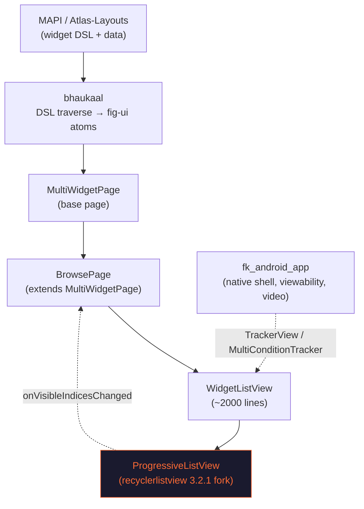
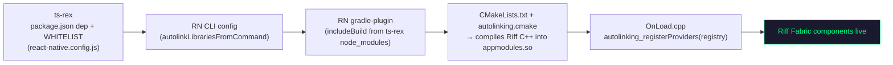
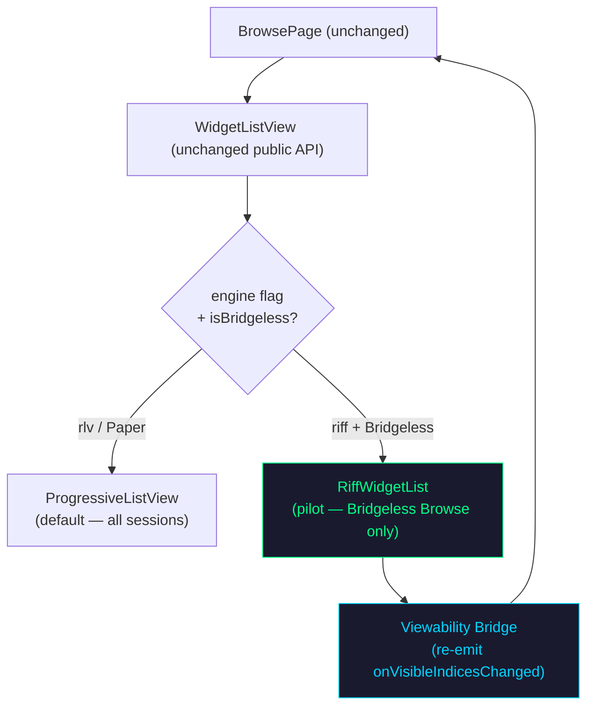

# Riff → Flipkart App Integration Plan (Browse Pilot)

> Goal: integrate Riff as the list engine for the **Browse / PLP vertical** in the Flipkart app, behind a feature flag, with full functional + performance parity against the current `ProgressiveListView` (internal `recyclerlistview` fork).
>
> Browse is chosen as the pilot because it is a **homogeneous product feed** — exactly where Riff's benchmarks were strongest (Search Results: Riff 11–4).

---

## 0. Verified host findings (investigated in `fk_android_app`)

Both prerequisites have now been answered by reading the host build directly.

### P1 — RN version: **0.80.2** (confirmed)

- `fk_android_app/build.gradle`: `reactNativeVersion = "0.80.2"`, forced via `resolutionStrategy` for both `com.facebook.react:react-android` and the Flipkart fork.
- `flipkart_ecom_app/build.gradle`: `implementation 'com.facebook.react:hermes-android:0.80.2'`.
- `ts-rex` is also on `0.80.2`. The stack is consistent.

**Impact:** Riff was built against **RN 0.85.3**. It **must be rebuilt/ported to 0.80.2** — Fabric codegen, ShadowNode/State C++ APIs, and Folly flags differ. This is real work, not a version-bump. (The host's own CMake notes "In RN 0.80, the 'reactnative' binary contains the Folly symbols…", showing 0.80-specific native wiring Riff must match.)

### P2 — New Arch / Bridgeless: **build-flag gated + runtime AB gated, NOT the default**

The host has a full New-Arch path but **ships Paper by default**. Three gates stack:

1. **Build gate** — `gradle.properties: newArchEnabled=false` (committed default).
  - When `false`: autolinking is off, an **empty `PackageList`** is generated, and ~25 New-Arch native libs are **explicitly excluded** from packaging (`librrc_view.so`, `libreact_render_*.so`, `libturbomodulejsijni.so`, …). The build genuinely ships old architecture.
  - When `true`: RN builds **from source**, autolinks against `ts-rex/node_modules`, and compiles Fabric components via `src/main/jni/CMakeLists.txt`. `BuildConfig.RN_AUTOLINK_ENABLED = newArchEnabled`.
2. **Runtime gate** — `RNUtilities.isNewArchEnabled` returns `false` unless `RN_AUTOLINK_ENABLED` is true AND (`ABKey.isNewArchEnabled` AB flag OR `config.isNewArchEnabled`). The `reactBuildTest` variant uses a local pref toggle instead.
3. **Bridgeless** — detected at runtime via `ReactNativeFeatureFlags.enableBridgelessArchitecture()`; Bridgeless symbols are present in the baseline profile, so New Arch here means **Bridgeless + Fabric**.

**Impact:** Riff (Fabric-only) requires a `**newArchEnabled=true` build** with the **AB flag on** for the cohort. The default Play Store build can't run Riff. The pilot rides the existing New-Arch rollout train — Riff cannot ship ahead of it.

### Bonus finding — JS bundle delivery is **OTA ("Binary React")**, decoupled from native

- ts-rex JS ships as **OTA bundles** (`homepage.ota`, `binaryreactassets/`, `BINARY_REACT_CONFIG_API`), updated independently of the APK/AAB.
- **New risk (B1 below):** a Browse OTA bundle that enables Riff JS can land on an installed binary whose **native** Riff code is older/absent → crash. Riff JS must be gated on a **native capability/version check**, not just an AB flag.

---

## 0b. iOS host findings (investigated in `fk-ios-app`)

The iOS app **mirrors Android almost exactly** — same RN version, same Paper-by-default + config-gated New Arch, same native infra families (RecyclerView, CoordinatorLayout, viewability). Riff already has a working iOS implementation (it was the parity reference for the Android work), which de-risks native dev — but the same gating constraints apply.

### iOS P1 — RN version: **0.80.2 / React 19.1.0** (confirmed)

- `fk-ios-app/package.json`: `"react-native": "0.80.2"`, `"react": "19.1.0"`. Identical to Android + ts-rex. **All three platforms are on the same RN.** Riff (0.85.3) still needs the 0.80.2 port, but it's a single port shared across platforms.

### iOS P2 — New Arch / Fabric: **build-flag off + app-config gated, NOT default**

- `Podfile`: `use_react_native!(:hermes_enabled => true, :new_arch_enabled => false)`. All extension `Info.plist`s set `RCTNewArchEnabled = false`. The committed build ships **Paper**.
- **Runtime/config gate exists**: `AppConfigUtils.enableNewArch` reads `ENABLE_RN_NEW_ARCH` (`enableRNNewArchitecture`) from app config; also `shouldUseNewArchitectureForReact` / `shouldUseNewArchitectureForHomePage`. Many native bridges branch on `[AppConfigUtils enableNewArch]`. The newer `ReactV4ViewController` tags `kIsNewArchitectureKey = 1` vs the legacy `ReactWidgetViewController = 0`.
- **Difference from Android:** iOS New Arch is flipped via the **Podfile build flag + app config**, with **no per-user AB cohort** like Android's `ABKey.isNewArchEnabled`. So iOS rollout is **coarser** — a New-Arch build goes out via phased App Store / TestFlight release rather than a runtime AB ramp. Plan the iOS pilot around build-level cohorts, not AB %.

### iOS linking — **CocoaPods + `use_native_modules!`**

- RN libs are added as pods (`:path => 'node_modules/...'`) and autolinked via `use_native_modules!` in `post_install`. `fk-ios-app` has its **own** small `package.json` (not ts-rex's node_modules).
- **For Riff:** add a `pod 'Riff', :path/:git`, ensure its `.podspec` enables Fabric codegen, and it must compile under a `new_arch_enabled => true` pod install. JS still arrives via OTA (`reactnative.ios.jsbundle`, `tsRexBundleVersion`, `RNConfigUtils` downloads by hash) — same OTA/native skew risk (B1).

### iOS native infra Riff must coordinate with (Browse)

Direct analogs of the Android managers:

| Concern                    | iOS component(s)                                                                                                                                | Android analog                          |
| -------------------------- | ----------------------------------------------------------------------------------------------------------------------------------------------- | --------------------------------------- |
| List / recycler            | `FKRecyclerViewManager` (RecyclerScrollView)                                                                                                    | `ProgressiveListView`                   |
| Sticky / collapsing header | `RCTCoordinatorLayout`, `RCAppBar`, `RCCollapsingBarBehaviour`, `RCBottomBar`, `ScrollCoordinator` pod                                          | CoordinatorLayout managers              |
| Viewability / impressions  | `NowYouSeeMe` / `NowYouSeeReact`: `ReactTrackableView`, `ReactMultiConditionView`, `ReactViewabilityCondition`; `TrackableContainerViewManager` | `TrackerView` / `MultiConditionTracker` |
| V4 multi-widget host       | `ReactV4ViewController` (+`ScrollCoordinatorManager`)                                                                                           | `MultiWidgetPage` / `WidgetListView`    |

The iOS "viewability bridge" target is **NowYouSeeMe**, exactly as the Android one is `TrackerView`/`MultiConditionTracker`.

---

## 1. System context (what's actually there today)

**Key files:**

- `ts-rex/src/page/BrowsePage.tsx` — the pilot page (extends `MultiWidgetPage`)
- `ts-rex/src/page/WidgetListView.tsx` — the list host (owns `ProgressiveListView`, sticky, pagination)
- `ts-rex/react-native.config.js` — native autolinking whitelist
- `fk_android_app/settings.gradle` — `includeBuild` of the RN gradle-plugin from `ts-rex/node_modules`; autolinking only wired when `newArchEnabled=true`
- `fk_android_app/flipkart_ecom_app/newarch.build.gradle` — `react { autolinkLibrariesWithApp(); root = ts-rex }`, CMake args, Hermes
- `fk_android_app/flipkart_ecom_app/src/main/jni/CMakeLists.txt` + `OnLoad.cpp` — Fabric C++ build + component registration (`autolinking_registerProviders`)
- `fk_android_app/.../apppackage/FkCrossPlatformPackage.java` — manual view-manager list (Paper) incl. viewability managers

### How Riff would actually link (mechanics)

Riff's Kotlin ViewManagers + C++ component descriptors register **through autolinking** (not by hand-editing `FkCrossPlatformPackage`), but **only in a `newArchEnabled=true` build**. The existing `TrackableNestedScrollViewComponentDescriptor` in `OnLoad.cpp` is the local-registration model if Riff ever needs a manually-registered descriptor.

### Native viewability infra Riff must coordinate with

`FkCrossPlatformPackage.createViewManagers()` already registers `TrackerViewManager`, `MultiConditionTrackerViewManager`, `HybridTrackerViewManager`, and `ReactNestedScrollViewabilityViewManager` (separate **Bridgeless** + Paper variants). These native trackers — not the JS list — drive video autoplay and impression tracking on top of `ProgressiveListView` today. **This is the concrete thing the Riff "viewability bridge" must plug into.**

**Browse-specific contracts Riff MUST preserve** (from `BrowsePage.tsx`):

| Contract                                           | Source                                      | Maps to in Riff                                     |
| -------------------------------------------------- | ------------------------------------------- | --------------------------------------------------- |
| `getMaxRenderAheadOffset() → 500`                  | line 477                                    | `renderRangeStart/End` window sizing                |
| `_onVisibleIndicesChanged(all, now, notNow)`       | line 632                                    | Riff viewability bridge re-emitting visible indices |
| `ScrollDirection.UP/DOWN`                          | `_onVisibleIndicesChanged`                  | Riff scroll-direction from scroll events            |
| Scroll position save/restore on back press         | lines 137, 707 (`browsePageScrollPosition`) | Riff MVC scroll correction + offset persistence     |
| Sticky / collapsing header, footer, floating slots | `barChildrenBehaviours`, `getCompareSlot`   | Coordinator layout (native) + Riff sticky headers   |
| Video preload by offset + `VideoOrchestrator`      | lines 118, 755                              | Riff viewability events feeding video triggers      |
| `handleScrollIdle()`                               | line 251                                    | Riff scroll-idle callback                           |

---

## 2. Strategy — engine swap behind the existing interface

**Do not rewrite `WidgetListView`.** Introduce a Riff-backed engine selectable by flag, keeping the `WidgetListView` public API, DSL, widgets, and all `BrowsePage` callbacks identical.

**Why this shape:**

- Blast radius = internals of one file + one new adapter
- Rollback = flag flip
- DSL/widgets/tracking untouched
- Paper sessions silently keep working on RLV

---

## 3. Phased plan

### Phase 0 — Compatibility spike *(gate — 2 to 3 weeks)*

- **Port Riff to RN 0.80.2** (`android` Kotlin + `cpp` + iOS + codegen). Resolve ShadowNode/State/codegen/Folly-flag deltas from 0.85. *(P1 — confirmed required.)*
- Build the host with `newArchEnabled=true` against a local `ts-rex` (`rnProject=ts-rex`) and confirm autolinking + source CMake build succeed.
- Throwaway screen in `ts-rex` rendering a Riff list, run on `reactBuildTest` (New-Arch pref toggle on).
- Verify runtime gating (`RNUtilities.isNewArchEnabled`) + fallback to `ProgressiveListView` on a Paper build.
- **Exit:** Riff renders + scrolls on RN 0.80.2 in a `newArchEnabled=true` Bridgeless build; falls back cleanly on Paper.

### Phase 1 — Native packaging *(1 week)*

- Publish Riff to JFrog (`npm_ts_rex_virtual`); add as a `ts-rex` `package.json` dependency.
- Add Riff package name to `WHITELIST` in `ts-rex/react-native.config.js` (autolinking is whitelist-gated).
- Confirm Riff C++ compiles into `appmodules.so` via autolinking CMake, and ViewManagers/descriptors register through `autolinking_registerProviders` (`OnLoad.cpp`). Add a manual descriptor only if needed (model: `TrackableNestedScrollViewComponentDescriptor`).
- iOS: Podspec + autolinking; add any `patch-package` patches.
- Confirm a `newArchEnabled=true` release-style build of the host app links Riff.

### Phase 2 — Adapter layer *(2 to 3 weeks)*

- `RiffWidgetList` — implements the slice of `WidgetListView` Browse needs:
  - data/layout providers → Riff render window
  - `rowRenderer` reuse (same widget render path)
  - `getMaxRenderAheadOffset()` → Riff render range
- **Viewability bridge** — translate Riff scroll/visibility events back into `onVisibleIndicesChanged(all, now, notNow)` so product counting, position logging, pagination, sticky, and FCP marks keep working unchanged.
- Wire scroll-direction, `handleScrollIdle`, and scroll-position save/restore (Riff MVC) for back-press restoration.
- Bridge native viewability (`TrackerView` / `MultiConditionTracker`) + `VideoOrchestrator` triggers to Riff visibility.

### Phase 3 — Browse pilot behind flag *(1 to 2 weeks)*

- `engine="riff"` path in `WidgetListView`, gated by config flag + `isNewArchEnable` (`global.RN$Bridgeless`).
- Sticky header / collapsing app bar / footer (Compare bottom bar) / floating slots parity.

### Phase 4 — Parity + perf validation *(2 weeks)*

- Functional parity matrix (below) green.
- On-device perf vs RLV using the existing scorecard methodology — **on real Browse server data, not synthetic RiffDemo.**
- Validate on a mid/low-end device tier, not just flagship.

### Phase 5 — Rollout

- Shadow → small AB → ramp, all flag-controlled, instant rollback.

---

## 4. Functional parity matrix (Browse)

| Capability                     | RLV today                    | Riff must do               | Risk                      |
| ------------------------------ | ---------------------------- | -------------------------- | ------------------------- |
| Vertical product feed          | ✅                            | Render window + recycling  | Low                       |
| `onVisibleIndicesChanged`      | ✅ native callback            | Re-emit from scroll events | **High** — many consumers |
| Pagination / end-of-list       | ✅                            | Visibility-driven          | Medium                    |
| Sticky / collapsing header     | ✅ CoordinatorLayout          | Coordinate native + Riff   | **High**                  |
| Sticky footer (Compare bar)    | ✅ footer slots               | Footer slot support        | Medium                    |
| Floating slots (Category FAB)  | ✅                            | Overlay handling           | Low                       |
| Scroll position restore (back) | ✅ LocalStaticStorage         | Riff MVC + offset persist  | Medium                    |
| Video autoplay / preload       | ✅ TrackerView + Orchestrator | Visibility bridge          | **High**                  |
| Scroll-direction tracking      | ✅                            | From scroll deltas         | Low                       |
| Nested horizontal rails        | ✅ RLV-in-RLV                 | Riff sub-containers        | Medium                    |

The three **High** items (viewability re-emit, sticky/coordinator, video) are where the real engineering effort sits — not the list rendering itself.

---

## 5. Key risks (updated with host findings)

1. **RN 0.85 → 0.80.2 port (P1, confirmed)** — Riff must be rebuilt against RN 0.80.2 (codegen, ShadowNode/State APIs, Folly flags). Hard blocker; do first in Phase 0.
2. **Fabric-only rides the New-Arch train (P2, confirmed)** — Riff needs a `newArchEnabled=true` build + `ABKey.isNewArchEnabled` cohort. It **cannot ship ahead of** the host's New-Arch rollout, and the default Play Store build won't run it. Paper fallback to `ProgressiveListView` is mandatory.
3. **OTA / native version skew (B1, new)** — ts-rex JS ships via OTA ("Binary React"), independent of the APK. Riff JS could reach a binary without matching Riff native → crash. Gate Riff JS on a **native capability/version probe**, not just the AB flag.
4. **Viewability is the real integration** — native `TrackerView` / `MultiConditionTracker` / `ReactNestedScrollViewability` managers (in `FkCrossPlatformPackage`) plus `onVisibleIndicesChanged` drive pagination, product counting, sticky, FCP, and video. Riff must reproduce/bridge these faithfully, not just scroll.
5. **Native whitelist + JFrog** — Riff must be a `ts-rex` dependency, added to `WHITELIST` in `react-native.config.js`, and compile from source via autolinking into `appmodules.so`. Host build (`fk_android_app`) owned by another team.
6. **Coordinator layout** — collapsing header / sticky pills are native CoordinatorLayout (`AppBarLayoutManager`, `CoordinatorLayoutManager`), not pure RN. Riff scroll must drive them.
7. **Benchmark realism** — prior numbers used synthetic RiffDemo data. Production validation must use real Browse responses; the homepage memory regression seen earlier may surface with real product images.

---

## 6. Open decisions / inputs still needed

Resolved by investigation: ~~P1 (RN 0.80.2, both platforms)~~, ~~P2 Android (New-Arch gradle flag + `ABKey.isNewArchEnabled`)~~, ~~P2 iOS (`new_arch_enabled` Podfile flag + `enableRNNewArchitecture` config)~~, ~~bundle delivery (OTA, both)~~, ~~iOS New-Arch status~~.

Still open:

- **New-Arch rollout timeline (both platforms)** — when does a New-Arch build reach enough real users for a Browse pilot? Riff is bound to this. Note Android can ramp via AB cohort; **iOS can only ramp via phased build releases** (no runtime AB for arch), so iOS timelines are coarser.
- Riff package name + JFrog (Android) / private-cocoapods (iOS) publishing paths.
- Owners for the `fk_android_app` (Gradle/CMake) and `fk-ios-app` (Podspec) native integrations — separate teams.
- Engine-switch flag naming + whether to reuse the existing New-Arch gates or add a Browse-specific Riff flag.
- Native capability-probe design for OTA/native skew protection (risk B1), shared across platforms.

---

*Companion to `android-perf-analysis.md`. Pilot scope: Browse vertical only, flag-gated, RLV fallback retained. Both platforms (Android `fk_android_app`, iOS `fk-ios-app`) investigated and on RN 0.80.2.*